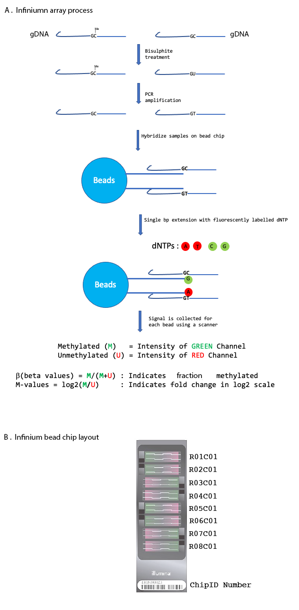
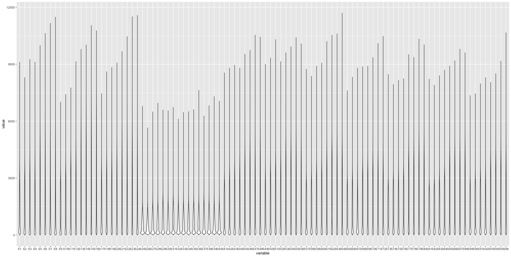
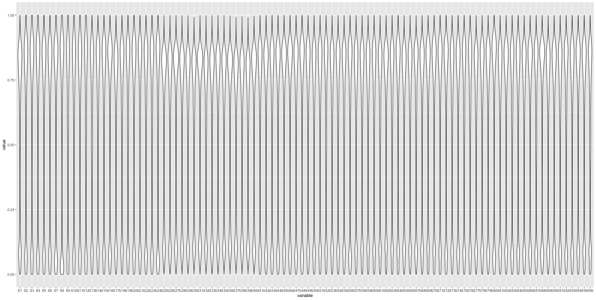
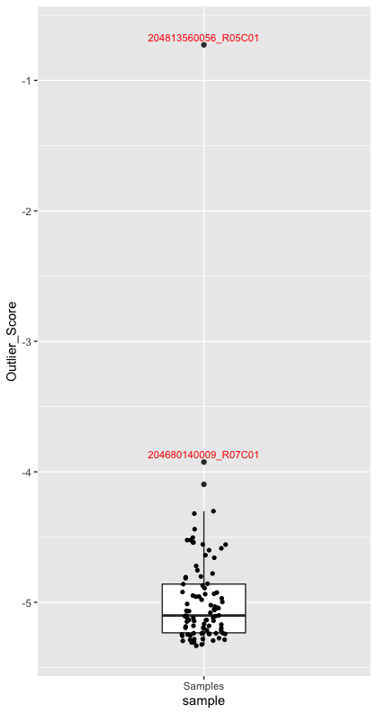

# EpicArrayAnalysis
R based Illumina Infinium Epicarray analysis
## Introduction

Illuminas Infinium MethylationEPIC arrays is a genome wide methylation analysis method which quantitaively detects methylation of over 850K methylation sites at single nucleotide resolution. The sites under investigation encompass CpG islands, open chromatin sites, enhancer regions and other regulatory regions of genome. A detailed account on arrays can be found [here](https://genomebiology.biomedcentral.com/articles/10.1186/s13059-016-1066-1).

During the processing of the DNA sample under investigation, DNA is treated with bisulphite where unmethylated Cytosines, e.g 5mC and 5hmC, get converted to Uracil while methylated Cytosines remain unchanged.  In the array technology site specific probes are used that can differentiate between methylated and unmethylated versions and final read out is relative fluorescent signals from the methylated vs. unmethylated sites. The outline of the process is illustrated below to demonstrate the concept. 



It is crucial to understand the layout of the arrays as well as this information can help to identify and remove chip based confounding factors. The layout of the arrays may differ between what is showned here vs what you might be using, so be aware of it.   Each chip has a chipID number and there are 8 slots (here) that allows assay for 8 samples.  Each slot is labelled as R0NC01, where 0N is the row number, since there is only one column so it is always C01.

### Data Format:
The scanner will produce .jpg image and .idat files.  IDAT is Illumina's properietary format to store summary intensities for each probe.  So for analysis we will be using IDAT files. The files are named as
```
ChipID_Numbe_SlotID_col.idat
204792210063_R01C01_Grn.idat  -> Green Channel Intensities
204792210063_R01C01_Red.idat  -> Red Channel Intensities
```
### Note

In order to do a complete analysis we will also need metadata of each sample. While processing samples for a case-control study of few laboratory samples, one may not have a metadata, thats fine, but use whatever information to its maximum.  However in my case I have 192 human samples and I would like to estimate the changes in methylation so I am collecting as much metadata as I can including `Gender, Age, Race, smokingStatus` other relevant information.

Cell type Deconvolution :  If the samples have cells of mixed type e.g blood or saliva samples,  one would like to apply deconvolution to account for cell types. My samples were Saliva samples so for EWAS I will be controling for Epithelial, Fibroblast, B, NK, CD4T, CD8T, Monocytes. 

Ancestry(race): For methylation principal components, Comp.2 and Comp.3 are more accurate in assessing ancestry. One can also test the correlation between self-reported race and mPCs to see which components are better predictors. One can also use a PC plot to visualize.

## Analysis

### Quality Check of the probes and samples (InfiniumEpicArray-01-QualityChecks.R)

This step primarly collate all the datasets together, and then apply filters to identify bad samples and bad probes.

1. The required packages are loaded and missing are installed installed using the `install_needed_packages.R` script.
```
source("./install_needed_packages.R") # PATH TO SOURCE FILE, this is an example path, change accordingly  

need_packages <- c("rlang", "stringi", "data.table", "purrr", "svd", "devtools","ewastools")

install_cran_pkgs(pkgs = need_packages)

check_installed(pkgs = need_packages)
```
2.  Read the metadata in `pheno` object and based on the information in metadata, the corresponding `.idat` files are loaded in `meth object`. `pheno` object
```
pheno <- read.csv("samplesheet_metadata.csv")

head(pheno)

 Sample_Name Sample_Well Sample_Plate Sample_Group pool_ID    SentrixID SentrixPosition MatID Ne0ID PTSD Mplate Mage Mrace Nsex LngthDeliv HeadCircum BirthHght Birthweight Gestation HeartRate
1 202908430099_R01C01         A01       plate1       PTSD_M      NA 202908430099          R01C01  M004  N004    1      1   20     3    0       1.75       30.5      18.5        2664     39.57       130
2 202908430099_R02C01         B01       plate1     NOPTSD_M      NA 202908430099          R02C01  M006  N006    0      1   20     3    0      11.00       33.0      19.0        3374     41.43       140
3 204920840025_R05C01         E11       plate2       PTSD_M      NA 204920840025          R05C01  M013  N013    1      2   25     3    1      14.50       34.0      21.0        3515     39.43       158
4 204842600013_R05C01         E05       plate2     NOPTSD_M      NA 204842600013          R05C01  M015  N015    0      2   24     3    0       5.75       32.5      20.0        2980     40.14       120
5 204792210005_R05C01         E07       plate2     NOPTSD_M      NA 204792210005          R05C01  M017  N017    0      2   20     6    0       6.25       32.0      18.0        2410     36.86       138
6 202908430099_R03C01         C01       plate1       PTSD_M      NA 202908430099          R03C01  M021  N021    1      1   34     3    1       3.00       33.0      19.5        3130     39.57       124
```
Reading idat files
```
meth <- read_idats(paths, quiet = FALSE)
```

3. I prefer to keep plotting my data as I go along the analysis to get a feel about the dataset and to look for potential issues .  Below is the violin plot of raw intensities (methylated probes) across the samples. I could spot that some samples(S25-S40) have unexpectadely low values and same was observed for unmethylated intensities which made me suspect the quality of the Chip since all 16 samples belong to 2 distinct chips.  Later on we will see that these 16 samples failed the QC and has to be dropped from analysis.
```
df<-as.data.frame(meth$M)
colnames(df)<-paste0(rep("S",96),as.character(1:96))
df.m <- reshape2::melt(df, id.vars = NULL)
library(ggplot2)
ggplot(df.m, aes(x = variable, y = log10(value))) + geom_violin()

```


4. `control_metrics` function  evaluates 17 control metrics that is calculated using control probes available in each assay.  These 17 control metrics are helpful in identifying problemetic arrays or samples.   The details of these metrics is provided in the BeadArray Controls Reporter Software Guide available from the Illumina support [website](https://support.illumina.com/content/dam/illumina-support/documents/documentation/chemistry_documentation/infinium_assays/infinium_hd_methylation/beadarray-controls-reporter-user-guide-1000000004009-00.pdf).  The control metrics are then translated in TRUE and FALSE answering question "Did sample in question  failed based on the 17 metrics". The status of the samples is updated under column failed in `pheno` dataframe where `TRUE` indicate failed samples and `FALSE` are the good samples.
```
ctrls <- control_metrics(meth)
pheno$failed = sample_failure(ctrls)
table(pheno$failed)
```
5.  Quick pre processing, calculating beta values for QC purpose. `detectionP` compute detection p-values. p-values are based on the distribution of the intensities of the negative control probes or the U (M) intensities observed for completely methylated (unmethylated) probes, respectively [(Heiss and Just, 2019)](https://clinicalepigeneticsjournal.biomedcentral.com/articles/10.1186/s13148-019-0615-3). ` mask` is masking all probes with detection p-values below the specified threshold (here 0.01). Matrix with dye-bias corrected intensities using [RELIC](https://www.ncbi.nlm.nih.gov/pmc/articles/PMC5209853/#:~:text=RELIC%20is%20an%20efficient%20and,to%20facilitate%20DNA%20methylation%20studies.) `correct_dye_bias`. A matrix of non-normalized beta-values is generated using `dont_normalize`.
```
beta <- meth %>% detectionP %>% mask(0.01) %>% correct_dye_bias %>% dont_normalize
```
 Same code as above is used for Violin plots.

6. There are about 59 known SNP probes with name starting with **rs** in each assay.  Ideally in a random population we expect 25 % presence of each hoimozygous allele (AA or aa) and 50% of heterozygous alleles (Aa ,aA).  These SNP's will help us identify the distribution and help identifying any anomolies.  In order to achieve this we will use beta-distributed mixture models. The method will estimates the parameters of a mixture model consisting of three Beta distributions representing the two heterozygous and homozygous genotypes,and a fourth component, a uniform distribution, representing outliers.
```
snps <- meth$manifest[probe_type == "rs", index]
snps <- beta[snps, ]

genotypes <- call_genotypes(snps, learn = FALSE)
```
7. An outlier score is calculated by `snp_outliers` function based on the `genotype` object. Samples with value greater than -4 are recommended to be excluded from analysis.  The outlier status of each sample is updated in pheno table.  
```
pheno$outlier <- snp_outliers(genotypes)
if(!is.data.table(pheno)){
  pheno <- data.table(pheno)
}
pheno[outlier > -4, .(SampleID,outlier)]

###              SampleID   outlier
### 1: 204680140009_R07C01 -3.925083
### 2: 204813560056_R05C01 -0.726977

```
The outlier score is plotted below with 2 samples having score greater than -4. 
```
OutlierScore_df<-data.frame("sample"=rep("Samples",96), "sample_Name"=dimnames(genotypes$snps)[[2]],"Outlier_Score"=snp_outliers(genotypes))
ggplot(OutlierScore_df,aes(x=sample,y=Outlier_Score))+ 
  geom_boxplot()+
  geom_text(data=subset(OutlierScore_df,Outlier_Score > -4.0),aes(label=sample_Name,y=Outlier_Score+0.06),size=3,col="red",position = position_dodge(width=3))+
  geom_jitter(data=subset(OutlierScore_df,Outlier_Score < (-4.1)),shape=16, position=position_jitter(0.2))
```


8. Finally, we check if any of the samples are duplicates using `enumerate_sample_donors`. `enumerate_sample_donors` returns for each sample the donor IDs. if 2 samples are identical based on the genotypes same ID is returned.

```pheno$donor_id <- enumerate_sample_donors(genotypes)

# List duplicates
pheno[, n:=.N, by = donor_id]
# Check to see if there are any duplicates, and remove idats of the one from the folder
pheno[n > 1, .(SampleID,donor_id)]
```
9. Write the modified `pheno` object out to use in subsequent steps of analysis.

10. OPTIONAL :  Before saving the pheno table, the metadata can be scaled for using them in models.
```phenoScaled$LngthDeliv <-scale(phenoScaled$LngthDeliv)
phenoScaled$HeadCircum <-scale(phenoScaled$HeadCircum)
phenoScaled$BirthHght <-scale(phenoScaled$BirthHght)
phenoScaled$Birthweight <-scale(phenoScaled$Birthweight)
phenoScaled$Gestation <-scale(phenoScaled$Gestation)
phenoScaled$HeartRate <-scale(phenoScaled$HeartRate)
```

